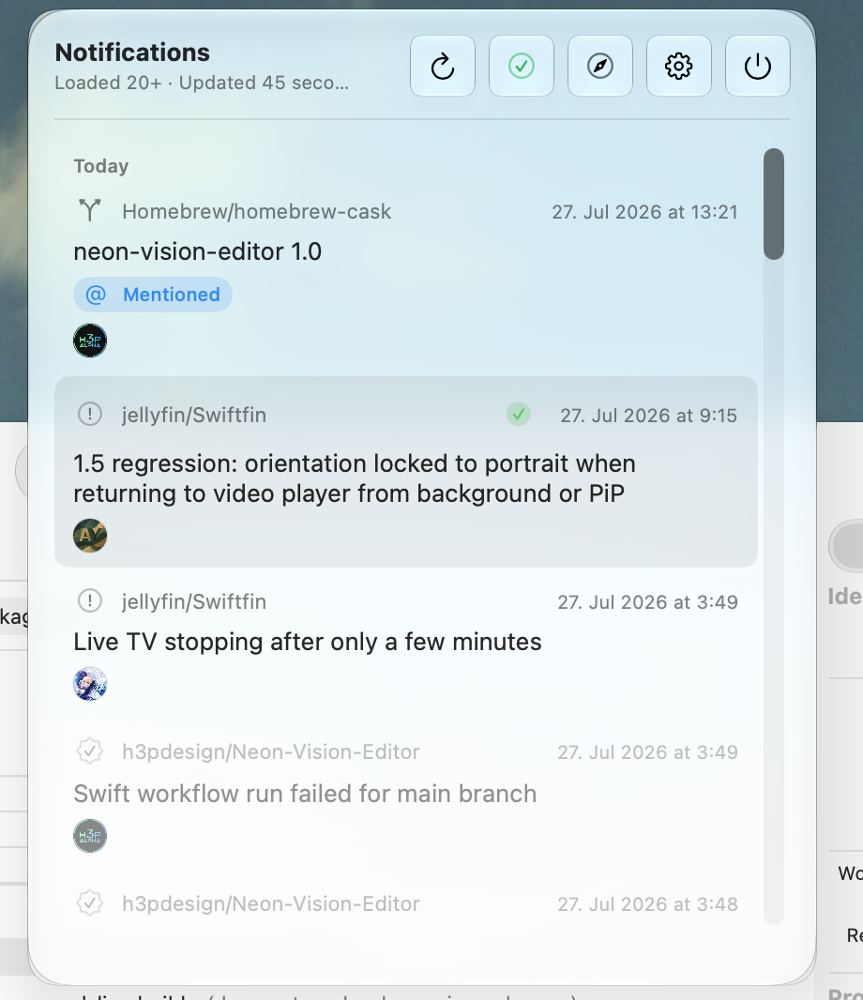

# GitBird

A native macOS menu bar app for keeping GitHub and GitLab notifications close at hand. GitBird runs quietly in the menu bar, refreshes in the background, and lets you open, read, or complete notification items without leaving your workflow.

<p align="center">
  
</p>

## Features

- GitHub Notifications API support.
- GitLab Todo API support for GitLab.com and self-managed GitLab hosts.
- Provider-aware HTTPS authentication with personal access tokens.
- Browser shortcuts for provider notification pages and token settings.
- Background polling with manual refresh and pagination.
- Hide read notifications by default, using server-side provider state.
- Mark individual items or the entire list as read/done on the provider.
- Native macOS menu bar experience with Liquid Glass styling on supported systems.
- Swift 6 and complete strict-concurrency checking.

## Requirements

- macOS 14.6 or later.
- A GitHub or GitLab account with an access token.
- Network access to the selected provider.

## Install

Download the latest signed build from [Releases](https://github.com/h3pdesign/GitBird/releases), move GitBird to `/Applications`, and launch it. GitBird is a menu bar app, so its main window appears from the menu bar icon.

## Configure GitHub

1. Open GitBird Settings.
2. Select **Account** and choose **GitHub**.
3. Create a GitHub personal access token from the linked token settings page.
4. Paste the token into GitBird and choose **Verify token**.
5. Adjust the refresh interval, page size, and read-notification visibility under **General**.

GitHub actions are sent back to GitHub over HTTPS, including marking a thread read, completing a thread, and marking all notifications read.

## Configure GitLab

1. Open Settings → **Account** and choose **GitLab**.
2. Enter the GitLab host, for example `https://gitlab.com` or your self-managed GitLab URL.
3. Create a GitLab personal access token from the linked token settings page.
4. Paste the token into GitBird and choose **Verify token**.

GitLab notifications are represented by the GitLab Todo API. Pending Todos are shown when read items are hidden; disabling that setting also requests completed Todos. On GitLab, marking an item read completes the Todo because GitLab does not expose a separate read state for Todos.

## Read and done behavior

The provider is the source of truth. GitBird does not maintain a separate local read database. When **Hide read notifications** is enabled, GitBird requests only items the provider still considers unread or pending. When it is disabled, read/completed items that still exist on the provider are eligible to appear.

Use the green check action to mark an item read. Use Delete or the done action to complete it. The refresh button reloads the current provider state.

## Build from source

You need Xcode with the macOS SDK installed. From the repository root:

```sh
DEVELOPER_DIR=/Applications/Xcode-beta.app/Contents/Developer \
xcodebuild -project GitBird.xcodeproj \
  -scheme GitBird \
  -configuration Debug \
  -derivedDataPath /tmp/GitBird-derived \
  CODE_SIGNING_ALLOWED=NO build
```

The project uses Swift 6 and enables complete strict-concurrency checking in Debug and Release configurations.

## Privacy and credentials

GitBird sends access-token-authenticated HTTPS requests only to the provider selected in Settings and to the notification subject URLs needed to display details. Tokens are stored in the app UserDefaults configuration today; use a dedicated token with the minimum permissions required by your provider.

## Lineage

GitBird is a standalone continuation of [GitStatus](https://github.com/0x2E/GitStatus). It has its own repository, bundle identity, release process, and feature set while preserving the original project menu bar notification concept.

## Credits

- App icon artwork: [IconPark](https://github.com/bytedance/IconPark)
- Menu bar icon inspiration: [Lucide](https://lucide.dev/icons/git-branch)

## License

See [LICENSE](./LICENSE).
