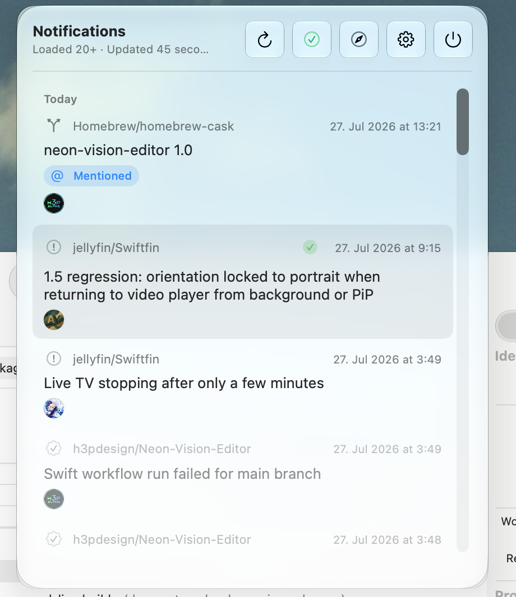

# GitBird

A native macOS menu bar app for keeping GitHub and GitLab notifications close at hand. GitBird runs quietly in the menu bar, refreshes in the background, and lets you open, read, or complete notification items without leaving your workflow.

<p align="center">
  
</p>

## Features

- GitHub Notifications API support.
- GitLab Todo API support for GitLab.com and self-managed GitLab hosts.
- Provider-aware HTTPS authentication with personal access tokens.
- Browser shortcuts for provider notification pages and token settings.
- Background polling with manual refresh and pagination.
- Hide read notifications by default, using server-side provider state.
- Mark individual items or the entire list as read/done on the provider.
- Native macOS menu bar experience with Liquid Glass styling on supported systems.
- Local search by title, repository, or notification reason (⌘F).
- Refresh (⌘R), Settings (⌘,), and explicit bulk-action scope confirmation.
- Optional launch at login under General settings.
- Optional App Store support tip and development/feedback links.
- Swift 6 and complete strict-concurrency checking.

## Changelog

See [CHANGELOG.md](./CHANGELOG.md) for the release history. The current release is [GitBird 2.1.6](https://github.com/h3pdesign/GitBird/releases/tag/v2.1.6).

## Requirements

- macOS 14.6 or later.
- A GitHub or GitLab account with an access token.
- Network access to the selected provider.

## Install

Download the latest signed build from [Releases](https://github.com/h3pdesign/GitBird/releases), move GitBird to `/Applications`, and launch it. GitBird is a menu bar app, so its main window appears from the menu bar icon.

## Configure GitHub

1. Open GitBird Settings.
2. Select **Account** and choose **GitHub**.
3. Create a GitHub personal access token from the linked token settings page.
4. Paste the token into GitBird and choose **Verify and save token**.
5. Adjust the refresh interval, page size, and read-notification visibility under **General**.

GitHub actions are sent back to GitHub over HTTPS, including marking a thread read, completing a thread, and marking all notifications read.

## Configure GitLab

1. Open Settings → **Account** and choose **GitLab**.
2. Enter the GitLab HTTPS origin, for example `https://gitlab.com` or your self-managed host, and choose **Use host**. Tokens are stored separately per host; verify the selected host’s token before it is used.
3. Create a GitLab personal access token from the linked token settings page.
4. Paste the token into GitBird and choose **Verify and save token**.

GitLab notifications are represented by the GitLab Todo API. Pending Todos are shown when read items are hidden; disabling that setting also requests completed Todos. On GitLab, marking an item read completes the Todo because GitLab does not expose a separate read state for Todos.

## Read and done behavior

The provider is the source of truth. GitBird does not maintain a separate local read database. When **Hide read notifications** is enabled, GitBird requests only items the provider still considers unread or pending. When it is disabled, read/completed items that still exist on the provider are eligible to appear.

Use the green check action to mark an item read. Use Delete or the done action to complete it. The refresh button reloads the current provider state. Bulk actions require confirmation: GitHub read applies to account notifications up to the last refresh time, GitHub done completes the loaded items (including search-hidden items), and both GitLab actions complete every pending Todo, including unloaded items.

Search filters only loaded notifications; **Load more** remains available. The menu bar count is the loaded unread count, with `+` when more pages exist. It is not a provider-wide total. Successful polling respects the selected interval; failures back off and provider retry/polling headers set a minimum wait.

## Build from source

You need Xcode with the macOS SDK installed. From the repository root:

```sh
DEVELOPER_DIR=/Applications/Xcode.app/Contents/Developer \
xcodebuild -project GitBird.xcodeproj \
  -scheme GitBird \
  -configuration Debug \
  -derivedDataPath /tmp/GitBird-derived \
  CODE_SIGNING_ALLOWED=NO build
```

The project uses Swift 6 and enables complete strict-concurrency checking in Debug and Release configurations.

## Support GitBird

Open Settings → **Support** for Patreon, repository, and feedback links. Optional App Store tip support is implemented, but requires App Store distribution and a configured, approved consumable before it becomes available. The GitHub release does not include a live App Store purchase product. All app features remain available without a purchase. The App Store tip is consumable and repeatable; it has no subscription, automatic renewal, or restorable feature entitlement. Pricing comes from StoreKit for the current storefront.

### App Store setup

The implementation uses product ID `com.h3p.GitBird.support.tip`. This is a proposed new GitBird product ID, not a verified App Store Connect listing. Before enabling tips in an App Store release:

1. Create a **Consumable** named **Optional Support Tip** for the `com.h3p.GitBird` app in App Store Connect, using exactly that product ID (or update the manager and local configuration to match an existing product).
2. Set the intended price and storefront availability. The local configuration uses 4.99 for testing; it does not set the production price.
3. Add localized display names/descriptions and an App Review screenshot of Settings → Support. Complete the required commercial agreements and tax/banking setup if needed.
4. Test pricing and purchases in a signed sandbox/TestFlight build. Submit the first consumable with a new app version, as described in [Apple’s submission guide](https://developer.apple.com/help/app-store-connect/manage-submissions-to-app-review/submit-an-in-app-purchase).

The shared GitBird scheme uses `GitBird/SupportOptional.storekit` only for local Xcode launch and test actions. Disable **Run → Options → StoreKit Configuration** when checking App Store sandbox pricing. The file is not included in the shipping app’s resources and does not create a product in App Store Connect.

Run the focused tests with your installed Xcode selected and a signed macOS host. Tests use the scheme’s local StoreKit configuration:

```sh
DEVELOPER_DIR=/Applications/Xcode.app/Contents/Developer \
xcodebuild -project GitBird.xcodeproj -scheme GitBird \
  -destination 'platform=macOS' -derivedDataPath /tmp/GitBird-tests \
  PRODUCT_BUNDLE_IDENTIFIER=com.h3p.GitBird.Validation \
  CODE_SIGN_IDENTITY=- CODE_SIGN_STYLE=Manual DEVELOPMENT_TEAM= \
  ENABLE_HARDENED_RUNTIME=NO ENABLE_APP_SANDBOX=NO test
```

The command above isolates test credentials and uses test-only signing/runtime overrides for local StoreKit. Shipping settings retain App Sandbox and hardened runtime. `.github/workflows/ci.yml` builds Release and runs these tests on pull requests and main-branch pushes; CI verifies source builds and local purchase behavior. The GitHub release workflow separately signs, notarizes, staples, and verifies the downloadable app. Signed App Store purchase validation remains a separate requirement before enabling live tips.

See [REVIEW.md](./REVIEW.md) for findings, fixes, evidence, and remaining release checks.

## Privacy and credentials

GitBird sends access-token-authenticated HTTPS requests only to the provider selected in Settings. GitHub tokens are used for approved GitHub API URLs; GitLab tokens are used only with the configured HTTPS GitLab host. Tokens are loaded asynchronously from the macOS Keychain. Token edits are drafts until **Verify and save token** succeeds. Legacy UserDefaults tokens are removed only after secure storage succeeds, and their original account is pinned across retries and restarts. Authenticated redirects must retain the same HTTPS origin, including port. Keychain failures are shown with a retry action; **Remove saved token** is an explicit confirmed action. Use a dedicated token with the minimum permissions required by your provider.

## Lineage

GitBird is a standalone continuation of [GitStatus](https://github.com/0x2E/GitStatus). It has its own repository, bundle identity, release process, and feature set while preserving the original project menu bar notification concept.

## Credits

- App icon artwork: [IconPark](https://github.com/bytedance/IconPark)
- Menu bar icon inspiration: [Lucide](https://lucide.dev/icons/git-branch)

## License

See [LICENSE](./LICENSE).
